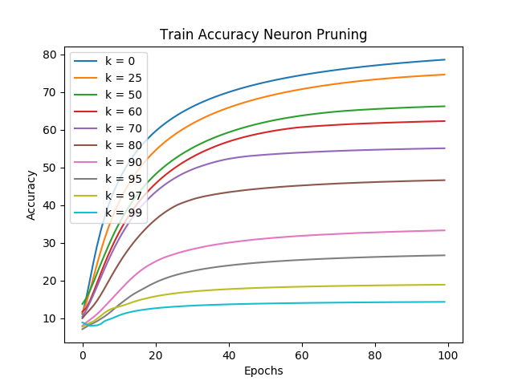
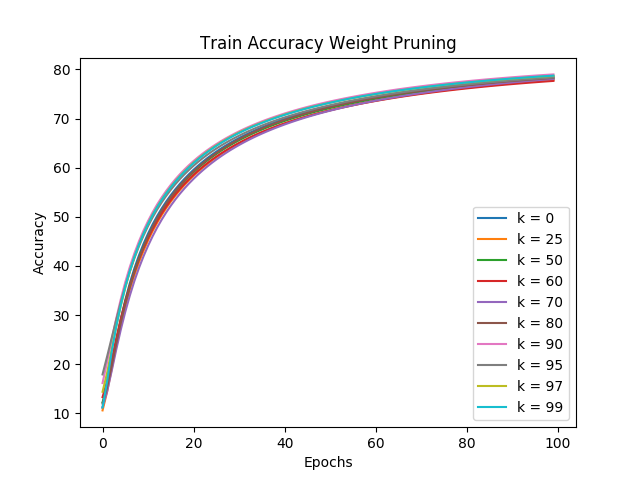
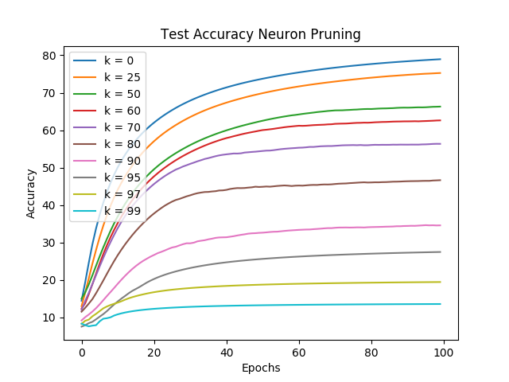
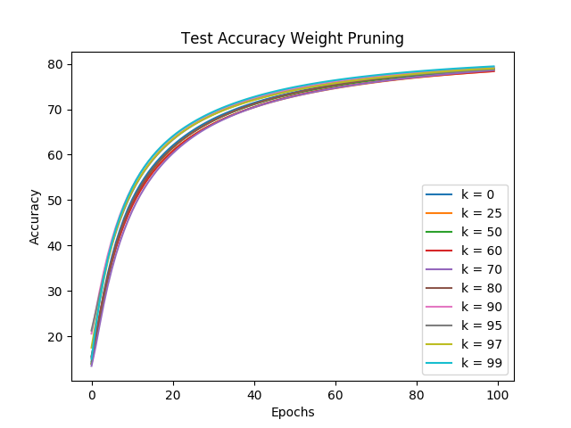
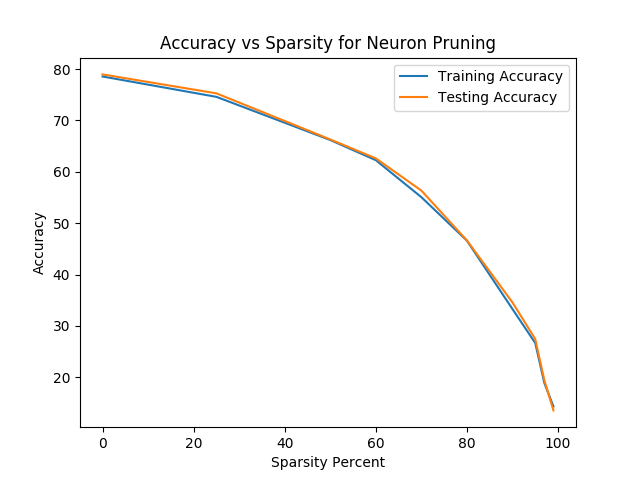
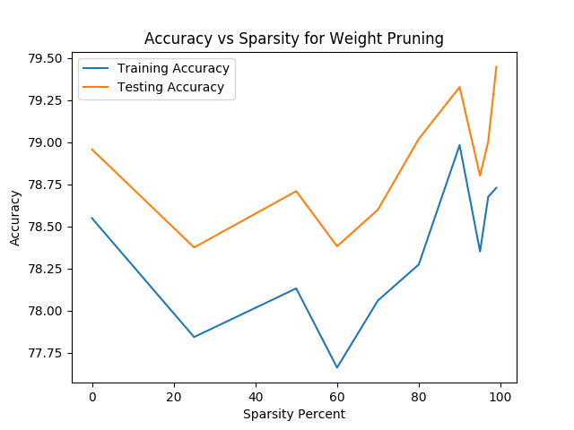
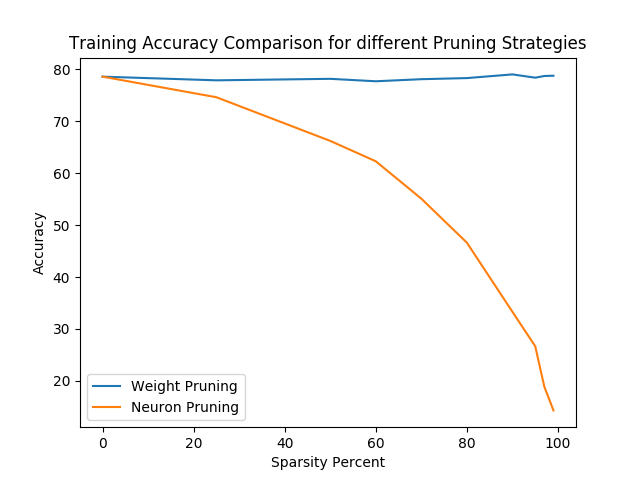
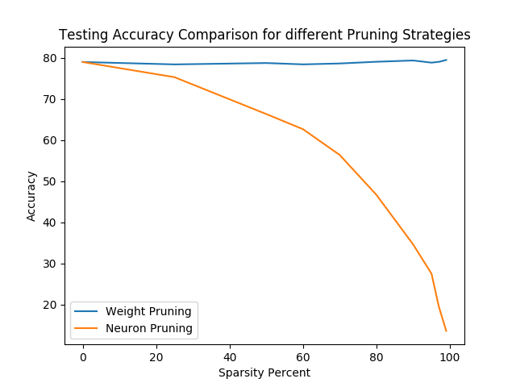
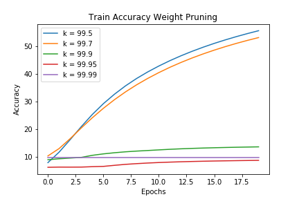
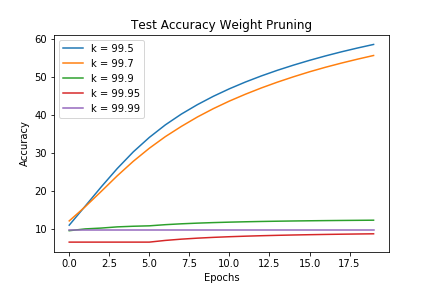

# Pruning Challenge

## Problem Description

We have a simple 3 hidden layered neural network. All the layers are a simple linear layer without any bias, i.e., a simple matmul and followed by relu activation.

```python
out = tf.maximum(tf.matmul(x, W), 0.0)
```

The entire neural network can be simply described as:

```python
out1 = tf.maximum(tf.matmul(inp, W1), 0.0)
out2 = tf.maximum(tf.matmul(out1, W2), 0.0)
out3 = tf.maximum(tf.matmul(out2, W3), 0.0)
out4 = tf.maximum(tf.matmul(out3, W4), 0.0)
out5 = tf.maximum(tf.matmul(out4, W5), 0.0)
```

Now we have 2 pruning strategies -
1. Weight Pruning
2. Neuron/Unit Pruning

We need to compare the two strategies based on the accuracy attained while training the model on MNIST.

## Steps to Reproduce Results

```bash
# Create a virtual environment
python3 -m virtualenv pruning
# Activate the environment
source pruning/bin/activate
# Install the dependencies
pip install -r requirements.txt
```

The pruning step is expensive and the models are trained for `100` epochs, so it is recommended to carry out the training in a GPU/TPU environment.

```bash
# Train the models
python main.py
# To get the plots
python plotting.py
```

Don't alter the directories generated by `main.py`, `plotting.py` needs them in the exact order.

**NOTE**: We train 2 models at a time. So it is recommended to have sufficient GPU memory.

You can use `train.py` to train individual models. For the instructions use `python train.py --help`. This will list the arguments it needs.

If you want to train 1 model at a time use the `main_alternate.py` script.

The results will be logged using tensorboard, so they can be viewed by using `tensorboard --logdir logs`

## Results

### Accuracy vs Epoch Plots

|  |  |
|:-:|:-:|
|  |  |

### Accuracy vs Sparsity

|  |  |
|:-:|:-:|
|  |  |

## Conclusions

1. From the accuracy curves it is clearly visible that we should always prefer using `Weight Pruning` over `Neuron Pruning`. However, it should be duly noted that Weight Pruning is a very expensive process. And the total training time for this is twice of that of the Neuron Pruning. However, the inference time for both is the same. So if we are able to sacrifice some training time we get some strong performance for Weight Pruning.

2. Making the networks sparse allow us to store the weights much more efficiently (in terms of space). Also it hardly affects inference time compared to dense models.

3. In Weight Pruning, we drop the weights which have the least absolute value. This is intuitive because those weights were not affecting the output much compared to the other neurons. Hence those weights were not carrying too much valuable information. So dropping them results in the other weights easily capture the information contained in them. Though the above plots might lead us into believing that we can indefinitely (ofcourse within reasonable bounds) increase sparsity without affecting performance. This is indeed incorrect. On furthur increasing the sparsity our result is as follows:

|  |  |
|:-:|:-:|

4. In Neuron Pruning, dropping an entire neuron affects the model much more critically. Since we are making the value of a neuron zero, we are stopping the flow of a lot of information. Because, every layer loses `k%` of its neurons, the effective sparsity in this case is much larger. In case of weight pruning, making individual weights zero doesn't lead to a lot of information loss while propagation because effectively the value of the neurons in each hidden layer does not change much, so it does not affect the following layer.

5. Also if inference time is not of much concern, we can convert the dense weights to sparse tensors, this will allow us to save a lot of memory without sacrificing much speed. The conversion is pretty simple as well:

```python
# W1 is a Dense Tensor
SW1 = tf.contrib.layers.dense_to_sparse(W1)
# Of course we need to take care of the dimensions of x.
# If we `time` it we see only a small speed bump. 
tf.sparse.matmul(SW1, x)
```

